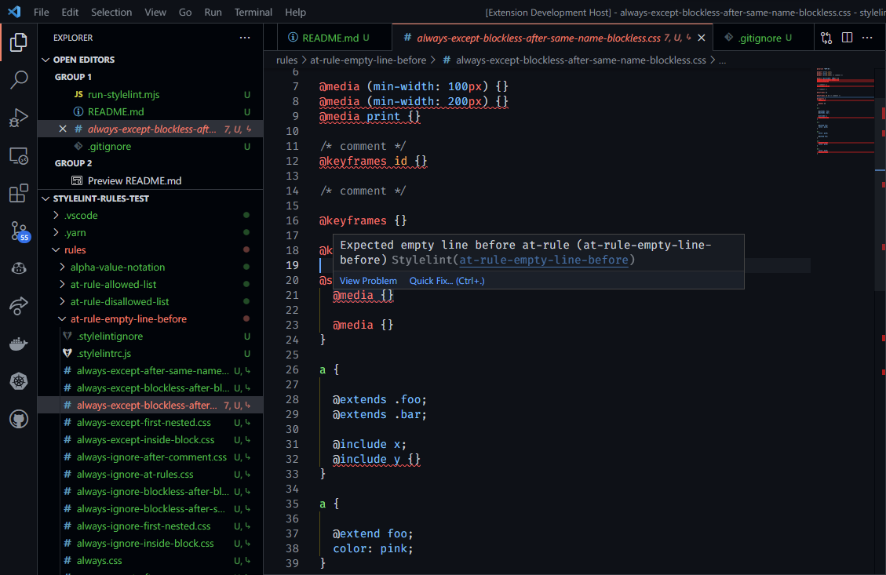
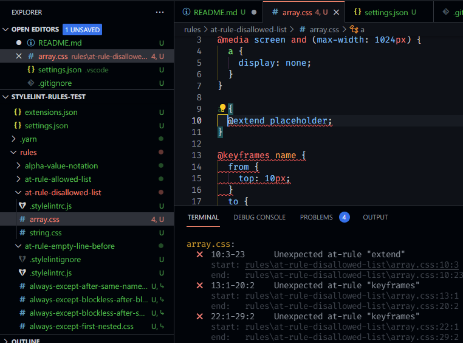

# stylelint-rules-test

## Clone and Install

1. Clone the repository:

   ```
   git clone https://github.com/adalinesimonian/stylelint-rules-test.git
   cd stylelint-rules-test
   ```

2. Update the Stylelint dependency path, if needed:

   This repository expects to see the Stylelint repository in a folder named `stylelint` two levels up from the root of the project. For example:

   ```
   /home/user/github:
   ├── adalinesimonian
   │   └── stylelint-rules-test
   └── stylelint
       └── stylelint
   ```

   If you are using a different directory structure, you can change the dependency in `package.json` to point to the correct location.

3. Install dependencies:

   ```
   yarn
   ```

## Test Using CLI

Run `yarn test` to test the rules. Run `yarn test -?` to see all available options.

## Test Using VS Code

1. First, run:

   ```
   git clone https://github.com/stylelint/vscode-stylelint.git
   cd vscode-stylelint
   git checkout report-ranges
   npm i
   code .
   ```

   This will clone the extension repository, install its dependencies, and open it in VS Code.

2. Then, press the **F5** key to start a copy of VS Code with the extension installed.
3. Open the **File** menu and select **Open Folder**, or press **Ctrl+K** then **O**.
4. Open the `stylelint-rules-test` folder.
5. Once the extension is loaded, you can open any file in the `rules` folder. You should see a list of errors reported by Stylelint:

   

   You can also press **Ctrl+\`** to open the terminal, from which you can run `yarn test` to run the tests using the CLI.

   You can also run `yarn test -l` to provide links to the errors that were reported, after which you can **Ctrl+Click** on the error to jump to the line in the file where the error was reported:

   
